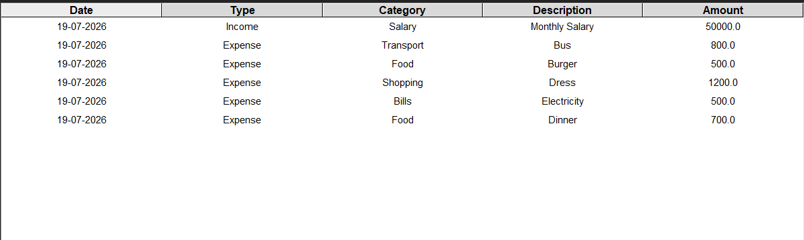
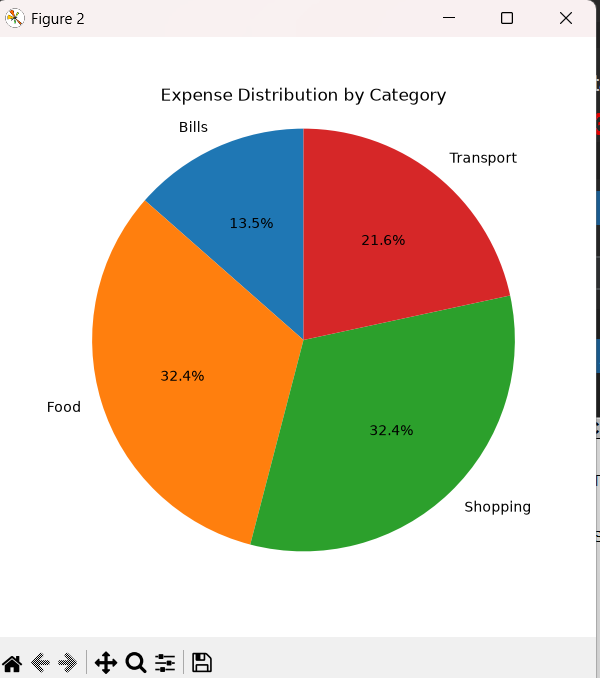

# 💰 Personal Expense Tracker Pro

A modern GUI-based **Personal Expense Tracker** developed using **Python**, **CustomTkinter**, **Pandas**, and **Matplotlib** as the **Final Project** for the **SoftGrowTech Python Programming Internship**.

---

## 👨‍💻 Developer

**Name:** Kashaf Waheed

**Domain:** Python Programming

**Internship:** SoftGrowTech

---

## 📌 Project Overview

Personal Expense Tracker Pro is a desktop application that helps users efficiently manage their personal finances. Users can record income and expense transactions, categorize them, monitor their financial balance, and visualize spending through an interactive pie chart.

The project demonstrates practical knowledge of Python programming, GUI development, file handling, data processing, and data visualization.

---

## ✨ Features

- 💵 Add Income Transactions
- 💸 Add Expense Transactions
- 📂 Category Selection
- 📝 Description Entry
- 📅 Automatic Date Generation
- 📊 Income Summary
- 💳 Balance Summary
- 📉 Expense Summary
- 📋 Transaction History Table
- 🗑 Delete Selected Transaction
- 🧹 Clear All Transactions
- 💾 Automatic CSV Data Storage
- 📈 Expense Distribution Pie Chart
- ⚠ Input Validation & Error Handling
- 🎨 Modern Dark-Themed CustomTkinter GUI

---

## 🛠 Technologies Used

- Python 3
- CustomTkinter
- Pandas
- Matplotlib
- Tkinter
- CSV File Storage

---

## 📂 Project Structure

```text
KashafWaheed_PythonProgramming/
│
├── expense_tracker.py
├── transactions.csv
├── requirements.txt
├── README.md
├── LICENSE
├── KashafWaheed_PythonProgramming_Report.pdf
└── screenshots/
    ├── home.png
    ├── transactions.png
    └── chart.png
```

---

## 📸 Screenshots

### 🏠 Main Interface


---

### 📋 Transaction History



---

### 📊 Expense Distribution Pie Chart



---

## ▶️ How to Run

### 1. Clone the repository

```bash
git clone https://github.com/kashafwaheed21/KashafWaheed_PythonProgramming.git
```

### 2. Open the project folder

```bash
cd KashafWaheed_PythonProgramming
```

### 3. Install the required libraries

```bash
pip install -r requirements.txt
```

### 4. Run the application

```bash
python expense_tracker.py
```

---

## 📦 Required Libraries

- customtkinter
- pandas
- matplotlib
- numpy

---

## 🎯 Learning Outcomes

Through this project, I strengthened my knowledge of:

- Python Programming
- GUI Development with CustomTkinter
- CSV File Handling
- Data Manipulation using Pandas
- Data Visualization using Matplotlib
- Event-Driven Programming
- Desktop Application Development
- Git & GitHub Project Management

---

## 📄 Internship Report

The complete project documentation is available in:

**KashafWaheed_PythonProgramming_Report.pdf**

---

## 📜 License

This project is licensed under the **MIT License**.

---

## 🙏 Acknowledgements

This project was developed as the **Final Project** for the **SoftGrowTech Python Programming Internship** to demonstrate practical Python programming skills and desktop application development.

---

## ⭐ If you like this project

If you found this project useful, consider giving the repository a ⭐ on GitHub.